# ZAF（Odza）アプリ 運用マニュアル（非エンジニア向け）

このマニュアルは、**技術用語に慣れていない方**が、アプリの表示や通知の内容を更新するときに使う手順書です。  
**やること**・**変更してよい項目**・**変更してはいけない項目**を、手順と画像（スクリーンショット）用の説明でまとめています。

---

## このマニュアルで分かること

| 項目 | 内容 |
|------|------|
| **運用時にやる操作** | Firestore の `quotes` / `zaf_products` / `campaigns` 更新、リマインダー文言の変更、キャンペーン送信 |
| **変更してよいもの** | Firestore データ（`quotes`、`zaf_products`、`campaigns`）、リマインダー通知のデフォルト文言（コード内） |
| **変更してはいけないもの** | 設定ファイル（app.json など）、鍵ファイル、ストレージのキー名、レイアウト用のコード |

不明な点は開発者に確認してください。

---

## 目次

1. [はじめに（用語と前提）](#1-はじめに用語と前提)
2. [アプリの画面一覧（全画面の説明とスクリーンショット）](#2-アプリの画面一覧全画面の説明とスクリーンショット)
3. [ZAF商品の画像・テキストの変更](#3-zaf商品の画像テキストの変更)
4. [名言（今日の気づき）の追加・変更](#4-名言今日の気づきの追加変更)
5. [キャンペーン・プッシュ通知の設定](#5-キャンペーンプッシュ通知の設定)
6. [リマインダー通知の文言変更](#6-リマインダー通知の文言変更)
7. [変更してよい項目・してはいけない項目の一覧](#7-変更してよい項目してはいけない項目の一覧)
8. [関連するWebページのURL](#8-関連するwebページのurl)
9. [Excel 等で管理しているデータの連携](#9-excel-等で管理しているデータの連携)
10. [Firestore 一括インポート手順（運用向け）](#10-firestore-一括インポート手順運用向け)
11. [キャンペーン送信の自動化とログ（Windows）](#11-キャンペーン送信の自動化とログwindows)

---

## 1. はじめに（用語と前提）

### 1.1 よく出てくる言葉

| 言葉 | 意味（やさしく言うと） |
|------|------------------------|
| **ファイル** | プロジェクトフォルダの中にある「〇〇.tsx」「〇〇.png」などのデータ。テキストや画像の入れ物。 |
| **編集する** | ファイルを開いて、中の文字や画像を書き換えること。 |
| **プロジェクトフォルダ** | アプリのソースが入っているフォルダ（例: `odza` という名前のフォルダ）。 |
| **再ビルド** | アプリを「作り直して」新しいバージョンを作ること。ファイルを変えたあと、ユーザーに配るアプリを更新するには通常ここが必要。 |

### 1.2 運用時の大前提

- 表示テキストや画像は、**指定したファイルだけ**を編集すると変更できます。
- ユーザー設定や履歴の一部は端末内に保存され、コンテンツ（`quotes`、`zaf_products`）と通知運用データ（`push_tokens`、`campaigns`）は Firestore を使用します。
- ファイルを保存しただけでは、**すでにインストールされているアプリ**には反映されません。**アプリの再ビルド**（または開発中の場合は画面の再読み込み）が必要です。

### 1.3 秘密情報（トークン・鍵）の扱い（必読）

- **Git にコミットしないもの:** サービスアカウント JSON、`EXPO_ACCESS_TOKEN`、`.env` に書いた秘密値。リポジトリには **`.env.example`**（中身は空の例だけ）を置き、実値は各人の PC または CI の秘密管理に置きます。
- **推奨:** 送信 PC では環境変数 **`GOOGLE_APPLICATION_CREDENTIALS`** に「鍵 JSON のファイルパス」を設定する（鍵をリポジトリ直下に置かない運用も可能）。CI では **`FIREBASE_SERVICE_ACCOUNT_JSON`**（JSON 文字列）が使えます。
- **Firestore ルール:** 本番では **`quotes` / `zaf_products` は読み取りのみ**、`push_tokens` は端末からの upsert のみ、`campaigns` はコンソール・Admin のみ、が安全です。雛形は **`docs/firestore.rules.production.example`** を Firebase Console の Rules にコピーして調整してください。

---

## 2. アプリの画面一覧（全画面の説明とスクリーンショット）

このセクションでは、アプリに含まれる**すべての画面**を一つずつ説明し、それぞれに対応するスクリーンショットを載せています。  
スクリーンショットはプロジェクトの **`assets/screenshots`** フォルダに保存されています。

---

### 2.1 スプラッシュ画面（起動時）

**ファイル:** `app/splash.tsx`

初回起動時やアプリを開いたときに、最初に表示される画面です。  
オンボーディングをまだ完了していない場合は「オンボーディング」へ、完了済みの場合は「ホーム」へ自動で進みます。

**主な要素:** アプリのロゴやブランド表示（数秒で切り替わる）。

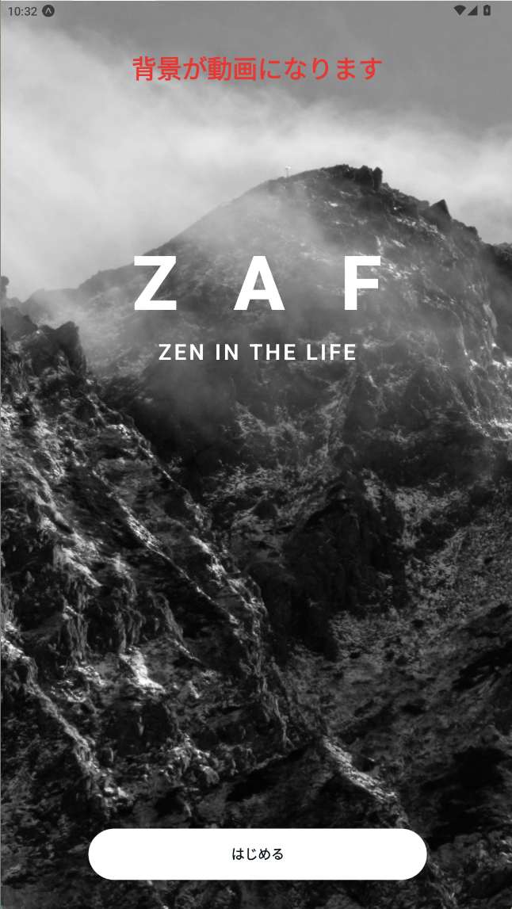

---

### 2.2 オンボーディング（初回紹介）

**ファイル:** `app/onboarding.tsx`

初めてアプリを使うユーザー向けの紹介画面です。スライド形式でアプリの目的や使い方を説明し、最後に「目標設定」へ進みます。

**主な要素:** スワイプで進むスライド、見出しと説明文、「次へ」などのボタン。


---

### 2.3 目標設定 STEP 1

**ファイル:** `app/goal-setup.tsx`

目標設定の 1 ステップ目です。「何日続けるか」といった目標日数を決める画面です。

**主な要素:** タイトル、説明文、入力または選択エリア、「次へ」ボタン。


---

### 2.4 目標設定 STEP 2

**ファイル:** `app/goal-setup-step2.tsx`

目標設定の 2 ステップ目です。1 日あたりの瞑想時間など、日次の目標を設定します。

**主な要素:** タイトル、説明文、設定項目、「次へ」ボタン。


---

### 2.5 目標設定 STEP 3

**ファイル:** `app/goal-setup-step3.tsx`

目標設定の 3 ステップ目（最後）です。設定内容の確認や同意ののち、メインの「ホーム」画面へ進みます。

**主な要素:** タイトル、説明文、「はじめる」または「完了」ボタン。

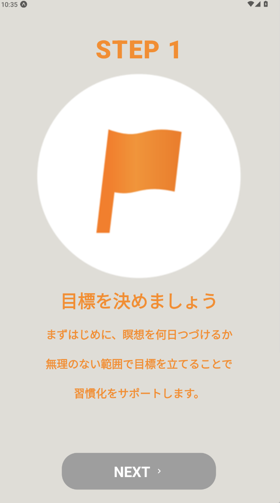

---

### 2.6 ホーム画面（HOME タブ）

**ファイル:** `app/(tabs)/index.tsx`

メイン画面の一つです。目標達成率の円グラフ、今日の瞑想時間、励ましのメッセージ、「今日のメニュー」、「今日の気づき」（名言）が表示されます。

**主な要素:**
- 画面上部: 「HOME」タイトル、プロフィールアイコンボタン
- 円グラフ: 目標達成率（〇日目/〇日）、励ましの 2 行テキスト、今日の瞑想時間、「詳しく見る」ボタン
- 今日のメニュー: ガイダンス動画へのリンク（例: 【ビギナー向け】座禅のいろは）
- 今日の気づき: 名言と出典

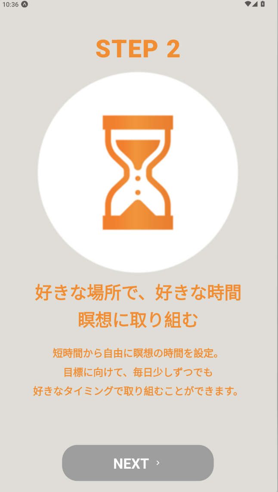

---

### 2.7 セッション画面（SESSION タブ）

**ファイル:** `app/(tabs)/session.tsx`

瞑想セッションを始めるための画面です。タイマーの時間を設定し、「はじめる」でタイマーを開始します。ガイダンスの ON/OFF、BGM、タイマー終了時の音なども設定できます。

**主な要素:**
- タブ: 「タイマー設定」「ガイダンス」
- 時間ピッカー: 時間・分（例: 3 時間 15 分）
- 「はじめる」ボタン
- ガイダンス有り / BGM 有りのトグル、タイマー終了時・BGM の設定行
- 最近の項目（過去のセッションから再開）

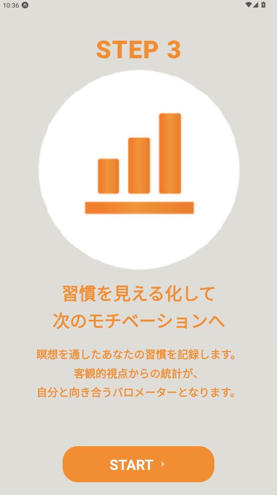

---

### 2.8 設定画面（SETTING タブ）

**ファイル:** `app/(tabs)/settings.tsx`

アプリ全体の設定を行う画面です。目標日数、1 日の目標瞑想時間、リマインダー、リマインダー通知のタイトル・本文、ZAF PRODUCTS、オンボーディングのリセットなどがあります。

**主な要素:**
- 目標日数（瞑想を続ける目標日数）
- 1 日の目標瞑想時間
- リマインダー一覧（時刻、ON/OFF、削除）、追加ボタン、通知タイトル・本文の入力欄
- 「目的に応じた瞑想の取り組み方」へのリンク
- ZAF PRODUCTS の商品カード（4 つ）
- 「オンボーディングをリセット」ボタン

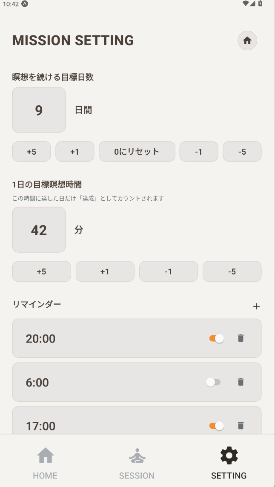

---

### 2.9 セッションタイマー画面

**ファイル:** `app/session-timer.tsx`

タイマーが動いている画面です。残り時間の円形表示、一時停止/再開、終了ボタンなどがあります。終了するとセッションが記録され、ホームの進捗に反映されます。

**主な要素:** 残り時間の表示、円形プログレス、再生/一時停止ボタン、終了ボタン。


*（画像はセッション画面です。タイマー実行中は「はじめる」タップ後の別画面になります。）*

---

### 2.10 ガイダンス動画画面

**ファイル:** `app/guidance-video.tsx`

ガイダンス動画を再生する画面です。「今日のメニュー」やセッション画面のガイダンスから遷移します。動画のあとタイマーへ進むこともできます。

**主な要素:** 動画プレイヤー、フルスクリーン、タイマーへ進むボタンなど。

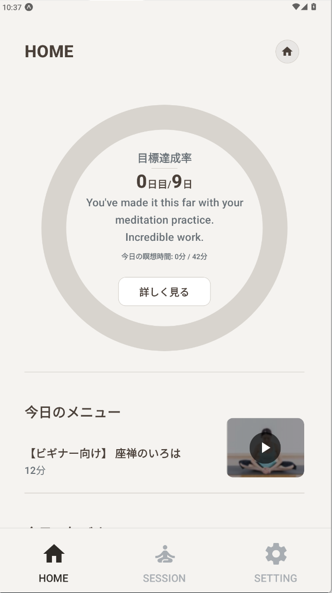
*（画像はホームの今日のメニュー付近です。ガイダンス動画は「今日のメニュー」やセッションのガイダンスから開きます。）*

---

### 2.11 プロフィール・レコード画面

**ファイル:** `app/profile-settings.tsx`

プロフィール設定と「レコード」（利用統計）を表示する画面です。左上のプロフィールアイコンや、設定画面のプロフィール欄から開きます。

**主な要素:**
- プロフィールアイコン、表示名
- タブ: 「ユーザー設定」「レコード」
- レコード: DAYS / HOURS / MISSIONS のバッジ、アプリ使用開始日、総瞑想日数・回数・時間、ミッション達成数
- ユーザー設定: ユーザー名を設定する、アイコンを設定する、カラーを設定する

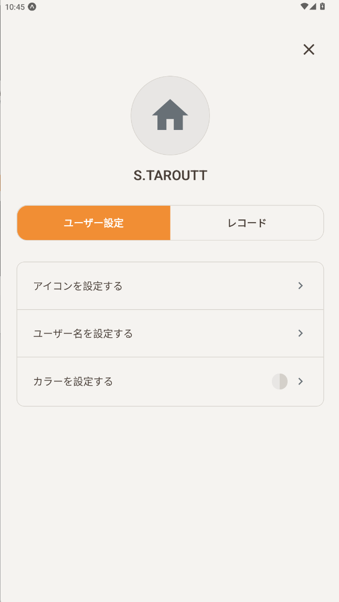

---

### 2.12 ユーザー名を設定する画面

**ファイル:** `app/profile-edit-name.tsx`

表示名（ニックネーム）を変更する画面です。プロフィール・ユーザー設定から「ユーザー名を設定する」をタップして開きます。

**主な要素:** 「戻る」、タイトル「ユーザー名を設定」、表示名の入力欄、「保存」ボタン。

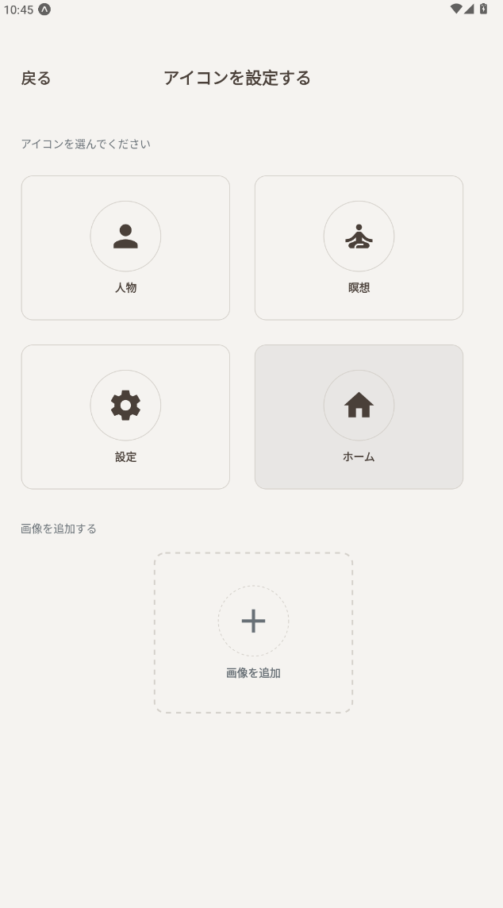

---

### 2.13 アイコンを設定する画面

**ファイル:** `app/profile-edit-icon.tsx`

プロフィールで使うアイコン（家、瞑想など）やカスタム画像を選ぶ画面です。

**主な要素:** 「戻る」、アイコン選択、カメラ/ギャラリーから画像を追加するオプション。

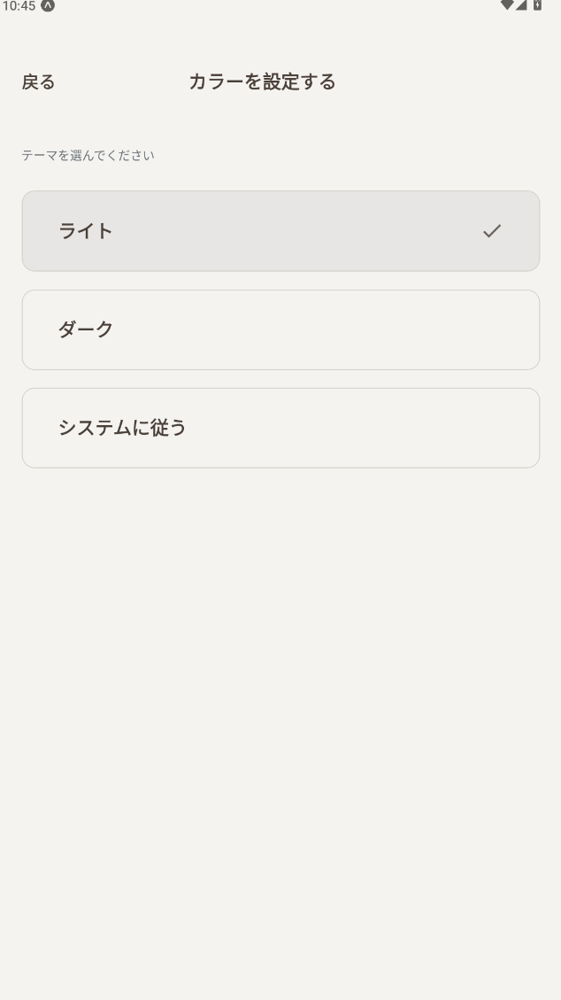

---

### 2.14 カラーを設定する画面

**ファイル:** `app/profile-edit-color.tsx`

アプリのテーマ（ライト / ダーク / システムに従う）を選ぶ画面です。選択後もこの画面のまま残り、テーマだけが切り替わります。

**主な要素:** 「戻る」、タイトル「カラーを設定する」、「テーマを選んでください」、ライト / ダーク / システムに従うの選択肢。

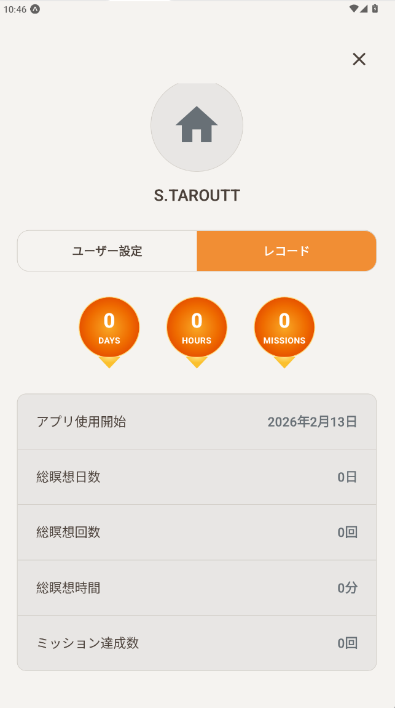

---

### 2.15 目標詳細画面（詳しく見る）

**ファイル:** `app/goal-detail.tsx`

ホームの「詳しく見る」から開く画面です。目標達成率の詳細や、日別の履歴などを表示します。

**主な要素:** 「戻る」、目標達成率や進捗の詳細、履歴リスト。

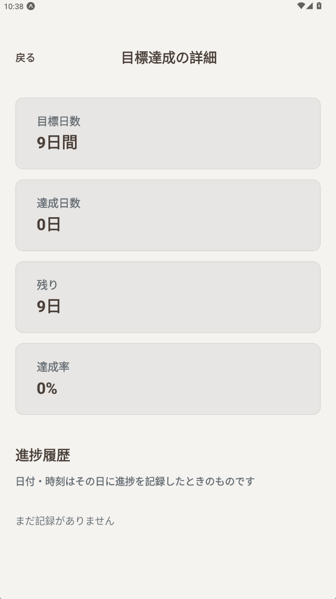

---

### 2.16 目的に応じた瞑想の取り組み方

**ファイル:** `app/meditation-purpose.tsx`

設定画面の「目的に応じた瞑想の取り組み方」から開く画面です。ストレス軽減・集中力向上・睡眠の質の向上・リラックスなど、目的別のヒントが表示されます。

**主な要素:** 「戻る」、タイトル、イントロ文、4 つのカード（ストレス軽減、集中力向上、睡眠の質の向上、リラックス）。

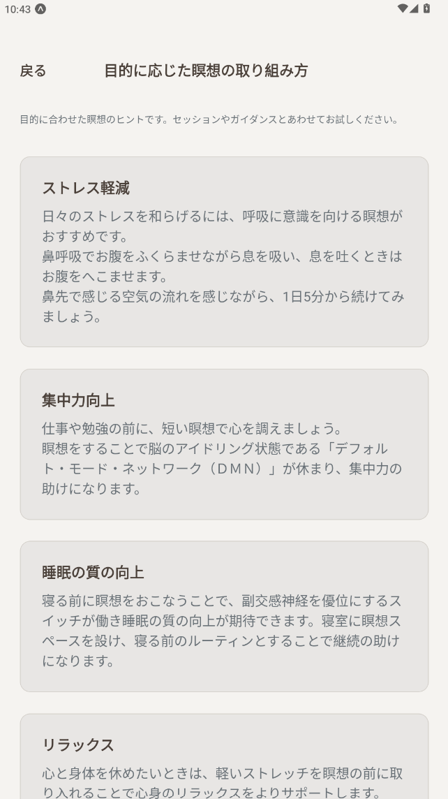

---

### 2.17 ZAF 商品詳細画面

**ファイル:** `app/zaf-product.tsx`

設定画面の「ZAF PRODUCTS」のカードをタップすると開く画面です。商品画像、タイトル、説明文は Firestore の `zaf_products` から表示されます。

**主な要素:** 「戻る」、タイトル「ZAF PRODUCTS」、商品画像、商品名、説明文。

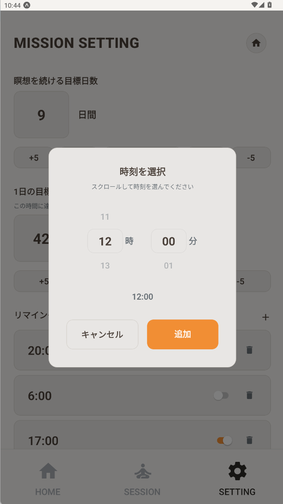

---

### 2.18 画面一覧のまとめ

| # | 画面名 | ファイル | 説明 |
|---|--------|----------|------|
| 2.1 | スプラッシュ | `splash.tsx` | 起動時の最初の画面 |
| 2.2 | オンボーディング | `onboarding.tsx` | 初回紹介スライド |
| 2.3～2.5 | 目標設定 STEP 1～3 | `goal-setup.tsx` 等 | 目標日数・時間の設定 |
| 2.6 | ホーム | `(tabs)/index.tsx` | 進捗・今日のメニュー・今日の気づき |
| 2.7 | セッション | `(tabs)/session.tsx` | タイマー設定・はじめる |
| 2.8 | 設定 | `(tabs)/settings.tsx` | 目標・リマインダー・ZAF PRODUCTS |
| 2.9 | セッションタイマー | `session-timer.tsx` | タイマー実行中 |
| 2.10 | ガイダンス動画 | `guidance-video.tsx` | 動画再生 |
| 2.11 | プロフィール・レコード | `profile-settings.tsx` | ユーザー設定・統計 |
| 2.12～2.14 | 名前・アイコン・カラー設定 | `profile-edit-*.tsx` | プロフィール編集 |
| 2.15 | 目標詳細 | `goal-detail.tsx` | 詳しく見る |
| 2.16 | 瞑想の取り組み方 | `meditation-purpose.tsx` | 目的別ヒント |
| 2.17 | ZAF 商品詳細 | `zaf-product.tsx` | Firestore の商品詳細を表示 |

**スクリーンショットのファイル名と画面の対応（`assets/screenshots` フォルダ）**

| ファイル名 | 対応する画面（本マニュアルの節） |
|------------|----------------------------------|
| `1.png` | 2.1 スプラッシュ |
| `2.png` | 2.2 オンボーディング |
| `3.png` | 2.3 目標設定 STEP 1 |
| `4.png` | 2.4 目標設定 STEP 2 |
| `5.png` | 2.5 目標設定 STEP 3 |
| `6.png` | 2.6 ホーム画面 |
| `7.png` | 2.7 セッション画面 / 2.9 セッションタイマー（参考） |
| `setting.png` | 2.8 設定画面 |
| `setting-2.png` | 2.16 目的に応じた瞑想の取り組み方 |
| `setting-4.png` | 2.17 ZAF 商品詳細 |
| `user.png` | 2.11 プロフィール・レコード |
| `user-1.png` | 2.12 ユーザー名を設定 |
| `user-2.png` | 2.13 アイコンを設定 |
| `user-3.png` | 2.14 カラーを設定 |
| `home-1.png` | 2.15 目標詳細（詳しく見る） |
| `home.png` | 2.10 ガイダンス動画（参考・ホームの今日のメニュー付近） |

※ `setting-1.png`、`setting-3.png`、`home-2.png`、`home-3.png` は設定・ホームの別アングルや部分のスクリーンショットとして利用できます。

---

## 3. ZAF商品の画像・テキストの変更

ZAF商品は Firestore の **`zaf_products`** コレクションから表示されます。  
アプリ側で `enabled=true` の商品だけ表示され、`imageUrl` が空なら既定画像を使います。

### 3.1 商品データを変更する（推奨：CSV 一括インポート）

**変更してよいもの：** `zaf_products` の `title`、`description`、`imageUrl`、`enabled`、`sortOrder`  
**変更してはいけないもの：** コレクション名、鍵ファイル名、運用スクリプト本体

#### 手順（ステップ）

1. `scripts/zaf-products.sample.csv` を Excel で開く  
2. 必要な行を編集（列順は変更しない）  
3. PowerShell でプロジェクトフォルダを開く  
4. 置き換え登録コマンドを実行

```bash
npm run import-zaf-products -- --file scripts/zaf-products.sample.csv
```

5. Firebase Console の `zaf_products` を確認  
6. アプリ再読み込み後、SETTING と商品詳細画面を確認

### 3.2 既存データを残して追記・更新したい場合

```bash
npm run import-zaf-products -- --file scripts/zaf-products.sample.csv --merge
```

---

## 4. 名言（今日の気づき）の追加・変更

ホーム画面の **「今日の気づき」** は Firestore の `quotes` から表示されます。  
現在は **15分ごとに動的にローテーション**し、同じ名言が連続しにくい仕様です。

### 4.1 名言データを変更する（推奨：CSV 一括インポート）

1. `scripts/quotes.sample.csv` を Excel で開く  
2. 列 `id,text,author,profession,enabled` を編集  
3. 置き換え登録コマンドを実行

```bash
npm run import-quotes -- --file scripts/quotes.sample.csv
```

4. Firebase Console の `quotes` を確認  
5. アプリ再読み込みで表示確認（最大15分で切り替わり）

### 4.2 既存データを残して追記・更新したい場合

```bash
npm run import-quotes -- --file scripts/quotes.sample.csv --merge
```

---

## 5. キャンペーン・プッシュ通知の設定

アプリでは **Firestore + Expo Push API** で通知を送信します。  
運用は Firestore の `campaigns` を **`status: "pending"`** にし、PC 上の送信スクリプトが Expo に渡し、その後 **レシート（配信結果）** を確認して Firestore に記録する方式です。

### 5.1 プッシュ通知を送る流れ（やさしく）

1. ユーザーがアプリを起動すると、端末ごとの **トークン**（通知を送るための識別子）がアプリ内に保存されます。  
2. 端末トークンは Firestore の **`push_tokens`** に保存されます。  
3. 運用担当が `campaigns` に **pending** のドキュメントを作り、`npm run send-campaigns` を実行します。  
4. スクリプトはまず Expo に **チケット（受付結果）** を送り、続けて **getReceipts** で FCM/APNs までの結果を取得します（時間がかかる分は数回ポーリングします）。  
5. 端末で通知が見えるかは OS・ネットワーク次第です。**「端末に表示された」ことの厳密な保証はレシートでも 100% ではありません**が、運用上は `deliveryOutcome` が最も信頼できる指標です。

### 5.2 非エンジニア向けチェックリスト（毎回この順）

1. **Firebase Console → Firestore → `campaigns`** でドキュメントを追加（または複製して編集）  
   - 必須イメージ: `title`（通知タイトル）, `body`（本文）, **`status`: `"pending"`**  
   - すぐ送らず予約したい場合: **`scheduledAt`** に **タイムスタンプ**（送信時刻より前は送られません）  
   - 任意: `data`（アプリ側で使う追加データオブジェクト）
2. **送信する PC** で Node.js が使えることを確認し、プロジェクトフォルダ（`odza`）を開く。  
3. **環境変数**（PowerShell の例）  
   - `EXPO_ACCESS_TOKEN` … Expo のアクセストークン（本番運用では設定推奨）  
   - `GOOGLE_APPLICATION_CREDENTIALS` … サービスアカウント JSON の**フルパス**（推奨）  
   - または鍵を `google-service-account-key.json` としてリポジトリ直下に置く（**Git に上げない**）
4. 送信実行:

```bash
npm run send-campaigns
```

5. **同じドキュメントを開き直し**、次を確認する:  
   - **`status`**: Expo への **受付** 結果（`sent` / `partially_sent` / `failed`）  
   - **`deliveryOutcome`**: **レシートに基づく配信結果**（下表）  
   - **`receiptPendingCount`**: まだレシートが返っていない件数。Expo の都合で遅れることがあります。  
6. 実機で通知を確認（エミュレータは不安定なことが多いです）。

### 5.3 `campaigns` に載る主なフィールド（送信後）

| フィールド | 意味（やさしく） |
|-----------|------------------|
| `status` | Expo が **リクエストを受け付けたか**（チケット段階）。`sent` でも端末未着の可能性があります。 |
| `sentCount` | チケットが `ok` だった件数（宛先トークン単位） |
| `errorCount` | チケットが `error` だった件数 |
| `receiptOkCount` | レシートで **FCM/APNs まで届いた** と判定された件数 |
| `receiptErrorCount` | レシートでエラーだった件数（無効トークンなど） |
| `receiptPendingCount` | ポーリング終了時点で **レシート未取得** のチケット数 |
| `deliveryOutcome` | まとめ判定（下表） |
| `invalidTokenCount` | 削除した無効トークン数（チケット＋レシートの `DeviceNotRegistered` 等） |
| `receiptCheckedAt` | レシート確認を終えた時刻 |
| `lastError` | 調査用の短いメッセージ（エラー時） |

**`deliveryOutcome` の値**

| 値 | 意味 |
|----|------|
| `delivered` | 受付できたチケットはすべてレシート `ok`（プロバイダまで到達） |
| `partially_delivered` | 成功と失敗が混在 |
| `failed` | 受付はできたがレシートは主にエラー |
| `receipts_pending` | タイムアウト時点でレシートがまだ足りない（必要なら `EXPO_RECEIPT_MAX_WAIT_MS` を延ばす・後から再実行方針を開発者と決める） |
| `submission_failed` | Expo 受付段階で送れるチケットがなかった |
| `unknown` | 想定外（ログを開発者に共有） |

### 5.4 ログファイル・レシート待ち時間（任意設定）

- **ログをファイルに残す:** `CAMPAIGN_LOG_FILE` を設定するか、次を実行すると既定で `logs/campaign-run.log` に追記されます。

```bash
npm run send-campaigns:log
```

- **レシート待ち:** 既定は約 **2 分**（`EXPO_RECEIPT_POLL_INTERVAL_MS` / `EXPO_RECEIPT_MAX_WAIT_MS` で変更）。Expo のドキュメントでは最大 **15 分** 待つ例も紹介されています。詳細は **`docs/campaign-scheduling-windows.md`** も参照してください。

### 5.5 環境変数の一覧（`.env.example` と同じ内容の目安）

プロジェクト直下の **`.env`** に書いた値は、**`npm run send-campaigns`**（および **`send-campaigns:log`**）実行時にスクリプトが自動で読み込みます（シェルで別途 `export` しなくても構いません）。

| 変数名 | 用途 |
|--------|------|
| `EXPO_ACCESS_TOKEN` | Expo Push API 利用時の認証（推奨） |
| `GOOGLE_APPLICATION_CREDENTIALS` | サービスアカウント JSON のパス |
| `FIREBASE_SERVICE_ACCOUNT_JSON` | CI 等向けに JSON を文字列で渡す場合 |
| `CAMPAIGN_LOG_FILE` | ログ追記先パス（例: `logs/campaign-run.log`） |
| `EXPO_RECEIPT_POLL_INTERVAL_MS` | レシート再取得の間隔（ミリ秒） |
| `EXPO_RECEIPT_MAX_WAIT_MS` | レシート待ちのおおよその上限（ミリ秒） |

---

## 6. リマインダー通知の文言変更

**リマインダー**とは、ユーザーが設定画面で「何時」に通知するかを登録すると、その時刻に**端末で通知が鳴る**機能です。  
通知の**タイトル**と**本文**は、ユーザーが設定画面で編集できる項目として保存されています。

**運用側で「新しくリマインダーを設定するユーザー向けのデフォルト文言」を変えたい**場合は、コード内の次のファイルを編集します。

**変更してよいもの：** デフォルトのタイトル・本文の**文字列の中身**だけです。  
**変更してはいけないもの：** 定数名（`REMINDER_NOTIFICATION_TITLE` など）、ファイル名、キー名。

#### 手順（ステップ）

1. **デフォルト文言が書いてあるファイルを開く**  
   - **`lib/reminder-notifications.ts`** … タイトルと本文のデフォルト  
   - **`lib/background.ts`** … バックグラウンドから送る通知のデフォルト本文  
   - **`app/(tabs)/settings.tsx`** … 設定画面の「リマインダー通知のタイトル・本文」のプレースホルダー（初期表示のヒント）

2. **該当する文字列だけを書き換える**  
   - 例: `ZAF リマインダー` → 別のタイトルに  
   - 例: `瞑想の時間です。（{time}）` → 別の文に（`{time}` を入れておくと、通知時に時刻に置き換わります）

3. **保存**し、アプリを再ビルドすると、**これからリマインダーを設定するユーザー**には新しいデフォルトが使われます。  
   - すでに設定済みのユーザーは、各自が保存しているタイトル・本文のままです。

---

## 7. 変更してよい項目・してはいけない項目の一覧

### 7.1 変更してよい項目（運用で触る想定）

| やりたいこと | 編集するファイル・場所 | 備考 |
|-------------|------------------------|------|
| ZAF商品のタイトル・説明・画像URL | Firestore `zaf_products` / `npm run import-zaf-products` | `enabled` で表示制御 |
| 今日の気づき（名言） | Firestore `quotes` / `npm run import-quotes` | 15分ごとローテーション |
| キャンペーン通知の送信 | Firestore `campaigns`（`pending`）＋ PC で `npm run send-campaigns` | `deliveryOutcome` で配信結果を確認 |
| リマインダー通知のデフォルト文言 | `lib/reminder-notifications.ts`、`lib/background.ts`、`app/(tabs)/settings.tsx` の該当定数・プレースホルダー | 定数名は変えない |

### 7.2 変更してはいけない項目

以下を誤って変更・削除すると、**アプリが動かなくなる**か**データが読めなくなる**可能性があります。非エンジニアの方は編集しないでください。

| 種類 | 例 | 理由 |
|------|-----|------|
| 設定ファイル | `app.json`、`package.json`、`eas.json`、`tsconfig.json` | ビルドやパッケージ名の設定 |
| 認証・鍵 | `google-services.json`、サービスアカウント JSON（リポジトリ外＋`GOOGLE_APPLICATION_CREDENTIALS` 推奨） | 漏洩・削除・書き換えでプッシュが届かなくなる |
| レイアウト・起動処理 | `app/_layout.tsx`、`app/(tabs)/_layout.tsx` | 画面構成や通知の初期設定 |
| ストレージのキー名 | `lib/storage.ts` の `@zaf/` や各キー名 | 変えると既存データが読めなくなる |

**安全に変更するコツ:** 日々の運用は Firestore データ更新（またはインポートコマンド）を使い、アプリコードの直接編集は最小限にしてください。

---

## 8. 関連するWebページのURL

運用や確認のときに参照すると便利なページです。

| 用途 | URL | 説明 |
|------|-----|------|
| Expo の通知（プッシュ）送信 | https://expo.dev/notifications | ブラウザからプッシュ通知を送るためのツール・案内 |
| Expo のドキュメント（プッシュ通知） | https://docs.expo.dev/push-notifications/overview/ | プッシュ通知の概要（英語） |
| 通知の送信方法（Expo） | https://docs.expo.dev/push-notifications/sending-notifications/ | 送信手順の説明（英語） |
| EAS Build（ビルドの仕組み） | https://docs.expo.dev/build/introduction/ | クラウドでアプリをビルドする方法 |
| App Store Connect（iOS） | https://appstoreconnect.apple.com | iOS アプリの配布・管理（Apple ID が必要） |
| Google Play Console（Android） | https://play.google.com/console | Android アプリの配布・管理 |

**このプロジェクト内のドキュメント**

| ファイル | 内容 |
|----------|------|
| `README.md` | プロジェクトの起動方法、Android/iOS ビルド、プッシュの仕組み、ビジネスロジック（開発者向け・日本語） |
| `docs/push-notifications.md` | プッシュ通知の実装詳細・送信例（英語） |
| `docs/campaign-scheduling-windows.md` | Windows でのログ付き実行・タスクスケジューラ設定 |
| `docs/firestore.rules.production.example` | 本番向け Firestore セキュリティルールの雛形 |
| `.env.example` | 送信スクリプト用の環境変数テンプレート（秘密は書かない） |

---

## 9. Excel 等で管理しているデータの連携

アプリ本体は **Excel を直接読み込む機能**は持っていませんが、CSV インポートスクリプトで Firestore を更新できます。

- **名言・商品データを Excel で管理したい**  
  → Excel で編集後に CSV 保存し、以下で反映します。  
  - `npm run import-quotes -- --file <quotes.csv>`  
  - `npm run import-zaf-products -- --file <products.csv>`
- **キャンペーン通知を運用したい**  
  → Firestore `campaigns` に pending データを作成し、`npm run send-campaigns` を実行します。

---

## 10. Firestore 一括インポート手順（運用向け）

このプロジェクトには、**名言（quotes）** と **ZAF商品（zaf_products）** を Firestore に一括登録するためのコマンドが用意されています。  
Excel で管理した内容を CSV に保存して読み込む運用が可能です。

### 10.1 事前準備

1. プロジェクトフォルダ（`odza`）を開く  
2. PowerShell またはターミナルを開く  
3. **Firestore 書き込み用の認証**（どちらか）  
   - 推奨: 環境変数 **`GOOGLE_APPLICATION_CREDENTIALS`** にサービスアカウント JSON のパスを設定  
   - または: 鍵ファイルを **`google-service-account-key.json`** としてリポジトリ直下に置く（**Git にコミットしない**）  
4. 以下のサンプルがあることを確認  
   - `scripts/quotes.sample.csv`
   - `scripts/zaf-products.sample.csv`

### 10.2 名言（quotes）を一括登録する

#### 置き換え（既存データを消して入れ直し）

```bash
npm run import-quotes -- --file scripts/quotes.sample.csv
```

#### 追記・更新（既存データを残してマージ）

```bash
npm run import-quotes -- --file scripts/quotes.sample.csv --merge
```

### 10.3 ZAF商品（zaf_products）を一括登録する

#### 置き換え（既存データを消して入れ直し）

```bash
npm run import-zaf-products -- --file scripts/zaf-products.sample.csv
```

#### 追記・更新（既存データを残してマージ）

```bash
npm run import-zaf-products -- --file scripts/zaf-products.sample.csv --merge
```

### 10.4 CSV の列ルール

#### quotes 用 CSV
- `id,text,author,profession,enabled`

#### zaf_products 用 CSV
- `id,title,description,imageUrl,enabled,sortOrder`

### 10.5 インポート後の確認

Firebase Console の Firestore で次を確認します。

- `quotes` コレクションにデータが作成されている
- `zaf_products` コレクションにデータが作成されている
- `enabled` が `true` のデータだけがアプリに表示される

### 10.6 よくある注意点

- CSV の 1 行目（ヘッダー）を変更しない  
- カンマを含む本文は `"` で囲む  
- 失敗した場合は、鍵ファイルの場所とファイル名を確認する  
- 本番運用前に必ず少数データでテストしてから実行する

---

## 11. キャンペーン送信の自動化とログ（Windows）

手順の全文は **`docs/campaign-scheduling-windows.md`** にあります。要点だけ:

- **ログ付き実行:** `npm run send-campaigns:log`（既定で `logs/campaign-run.log` に追記）
- **タスク スケジューラ:** 定期的に `npm run send-campaigns` を実行。環境変数はタスク側で設定するか、同梱の **`.cmd` ラッパー**（秘密を書いたファイルは Git に含めない）で渡す。
- **失敗確認:** ログの `[ERROR]` と Firestore の `deliveryOutcome` / `receiptPendingCount` を見る。

---

## まとめ

- **運用で行う操作:** Firestore の `quotes` / `zaf_products` / `campaigns` 更新、リマインダー文言の変更、キャンペーン送信コマンド実行（**`deliveryOutcome` で配信結果を確認**）。
- **変更してよいもの:** Firestore データと運用用CSV（必要に応じてリマインダー文言のコード）。
- **変更してはいけないもの:** 設定ファイル、鍵ファイル、ストレージのキー名、レイアウト・起動用のコード。
- **スクリーンショット:** 文中の「**[スクリーンショット用]**」の部分は、後から画像を差し込む場所です。撮影内容と URL を記載しているので、そのとおりにキャプチャを追加すると、非エンジニアの方が手順を追いやすくなります。

不明点や、ここに書いていない変更（画面の文言を一括で変える、多言語対応など）は、開発者に相談してください。
